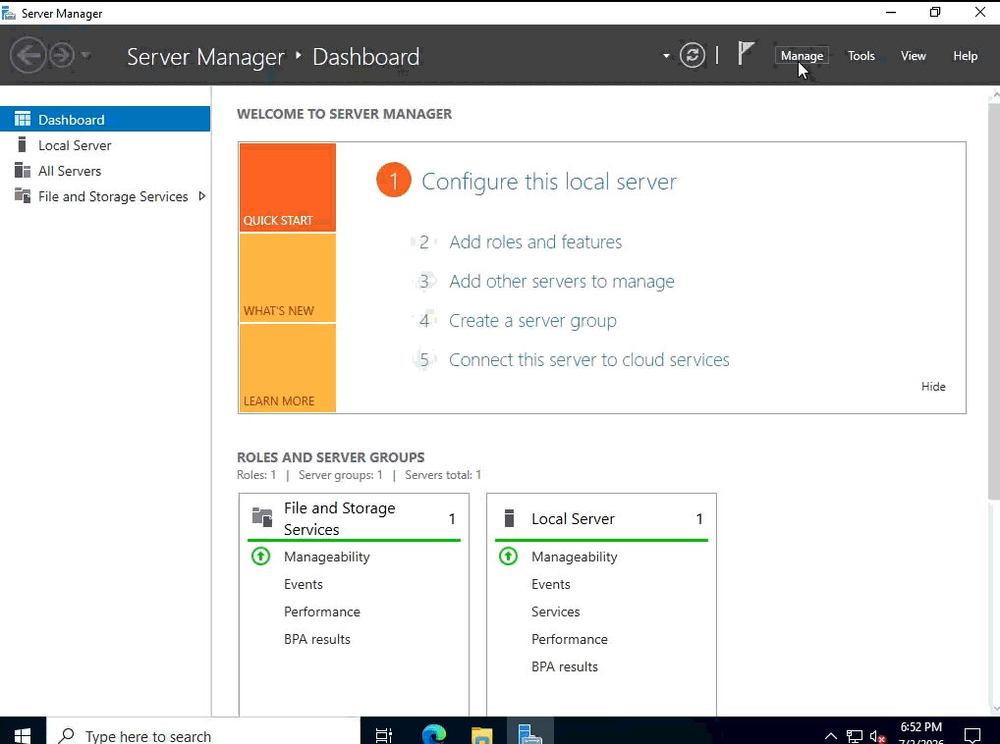

# Active Directory Lab — Multi-Region OU & Group Design

A hands-on home lab project deploying a Windows Server Active Directory environment from scratch, including a multi-region Organizational Unit (OU) structure and delegated security/distribution groups.

## Overview

| | |
|---|---|
| **Platform** | Windows Server 2016/2022 (VM) |
| **Tools** | Server Manager, AD DS, DCPromo Wizard, Active Directory Users and Computers (ADUC) |
| **Domain** | `llarraza.local` (new forest, new domain) |
| **Goal** | Build a realistic multi-site AD structure and understand OU design, group scope, and delegation |

## What I Did

### 1. Promoted the Server to a Domain Controller
Installed the AD DS role via Server Manager, then ran the Active Directory Domain Services Configuration Wizard, choosing **Add a new forest** and setting the root domain name.

### 2. Configured Domain Controller Options
Set the forest and domain functional levels, enabled DNS and Global Catalog roles, and set the DSRM recovery password.

### 3. Ran Prerequisites Check and Installed
Verified all prerequisite checks passed before completing the promotion (server reboots automatically at the end).

### 4. Verified the Domain in ADUC
Confirmed the new domain (`llarraza.local`) appeared in Active Directory Users and Computers, along with the default containers (Builtin, Computers, Domain Controllers, Users, etc.).

### 5. Designed a Multi-Region OU Structure
Rather than using the flat default containers, I built out a regional OU model — **North**, **South**, and **East** — each containing its own **Computer**, **Users**, and **Servers** sub-OUs. This mirrors how a real organization with multiple sites/offices would delegate management and apply Group Policy per region.

**Why this matters:** structuring OUs by region (rather than by object type alone) makes it possible to scope GPOs and delegate administrative permissions independently per site — e.g., a North IT admin doesn't need rights over South's objects.

### 6. Created Security and Distribution Groups
Inside `North/Users`, created:
- **IT** — a *Security* group (global scope), used for permission/access assignment
- **DL-ITAdmins** — a *Distribution* group, used for email distribution rather than access control

**Why this matters:** knowing the difference between a *Security* group (can be assigned NTFS/share permissions, added to GPOs) and a *Distribution* group (email-only, no security token) is a fundamental AD administration concept that trips up a lot of newcomers.

## Skills Demonstrated
- Active Directory Domain Services installation and forest/domain promotion
- Domain controller configuration (DNS, Global Catalog, functional levels)
- OU design and organizational planning for a multi-site environment
- Security vs. Distribution group scope and use cases
- Working within Server Manager, ADUC, and the AD DS Configuration Wizard

## Notes
This is a personal home-lab project built for learning purposes, following a guided tutorial as a base and extended with a custom regional OU/group structure. All values (domain name, IPs, passwords) are lab-only and not representative of a production environment.
